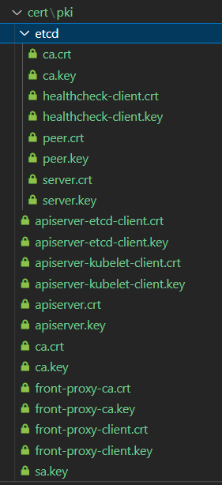

## 인증서 만들기 (Easy Way)



### 준비물

```bash
docker build -t week-1 .
mkdir cert_k8s

# Bash
docker run -v $(pwd)/cert_k8s:/etc/kubernetes -it --rm --add-host="test.kubernetes.local:127.0.0.1" week-1 bash
# PowerShell
docker run -v ${PWD}/cert_k8s:/etc/kubernetes -it --rm --add-host="test.kubernetes.local:127.0.0.1" week-1 bash
```

### 인증서 생성 도움말

```bash
kubeadm init phase certs all --help

Generate all certificates

Usage:
  kubeadm init phase certs all [flags]

Flags:
      --apiserver-advertise-address string   The IP address the API Server will advertise it's listening on. If not set the default network interface will be used.
      --apiserver-cert-extra-sans strings    Optional extra Subject Alternative Names (SANs) to use for the API Server serving certificate. Can be both IP addresses and DNS names.
      --cert-dir string                      The path where to save and store the certificates. (default "/etc/kubernetes/pki")
      --config string                        Path to a kubeadm configuration file.
      --control-plane-endpoint string        Specify a stable IP address or DNS name for the control plane.
      --dry-run                              Don't apply any changes; just output what would be done.
  -h, --help                                 help for all
      --kubernetes-version string            Choose a specific Kubernetes version for the control plane. (default "stable-1")
      --service-cidr string                  Use alternative range of IP address for service VIPs. (default "10.96.0.0/12")
      --service-dns-domain string            Use alternative domain for services, e.g. "myorg.internal". (default "cluster.local")

Global Flags:
      --add-dir-header           If true, adds the file directory to the header of the log messages
      --log-file string          If non-empty, use this log file (no effect when -logtostderr=true)
      --log-file-max-size uint   Defines the maximum size a log file can grow to (no effect when -logtostderr=true). Unit is megabytes. If the
value is 0, the maximum file size is unlimited. (default 1800)
      --one-output               If true, only write logs to their native severity level (vs also writing to each lower severity level; no effect when -logtostderr=true)
      --rootfs string            [EXPERIMENTAL] The path to the 'real' host root filesystem.
      --skip-headers             If true, avoid header prefixes in the log messages
      --skip-log-headers         If true, avoid headers when opening log files (no effect when -logtostderr=true)
  -v, --v Level                  number for the log level verbosity
```

- `apiserver-advertise-address`
  - SANs 에 추가할 IP 주소
- `apiserver-cert-extra-sans`
  - SANs 에 추가적으로 추가할 DNS 혹은 IP 주소
- `config`
  - https://github.com/kubernetes/kubernetes/blob/master/cmd/kubeadm/app/apis/kubeadm/v1beta3/types.go#L104-L106
- `service-cidr` `service-dns-domain`
  - 대부분의 컨트롤러들은 Service 에 부여된 도메인, 혹은 ClusterIP 를 사용해서 kube-apiserver 와 통신하므로 kube-apiserver SANs 에 해당 내용도 추가될 필요가 있다.

### 인증서 생성

```bash
kubeadm init phase certs all --apiserver-cert-extra-sans test.kubernetes.local
```
