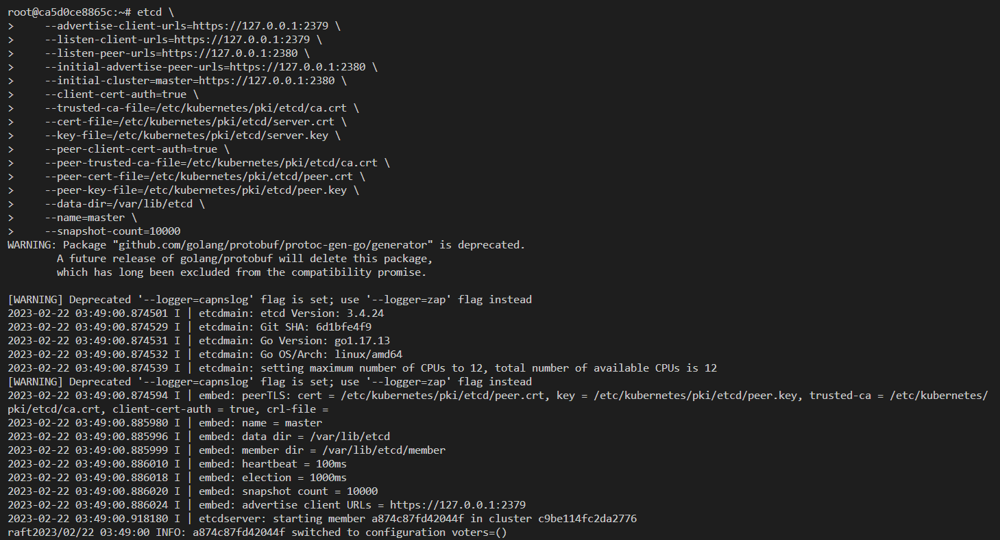

## etcd 실행하기



### 준비물

```bash
mkdir bin

# Bash
docker run -v $(pwd)/cert_k8s:/etc/kubernetes -v $(pwd)/bin:/root/bin -it --rm --add-host="test.kubernetes.local:127.0.0.1" week-1 bash
# PowerShell
docker run -v ${PWD}/cert_k8s:/etc/kubernetes -v ${PWD}/bin:/root/bin -it --rm --add-host="test.kubernetes.local:127.0.0.1" week-1 bash
```

### etcd 설치

```bash
bash /scripts/etcd_install.bash
```

### etcd 실행

```bash
nohup etcd \
    --advertise-client-urls=https://127.0.0.1:2379 \
    --listen-client-urls=https://127.0.0.1:2379 \
    --listen-peer-urls=https://127.0.0.1:2380 \
    --initial-advertise-peer-urls=https://127.0.0.1:2380 \
    --initial-cluster=master=https://127.0.0.1:2380 \
    --client-cert-auth=true \
    --trusted-ca-file=/etc/kubernetes/pki/etcd/ca.crt \
    --cert-file=/etc/kubernetes/pki/etcd/server.crt \
    --key-file=/etc/kubernetes/pki/etcd/server.key \
    --peer-client-cert-auth=true \
    --peer-trusted-ca-file=/etc/kubernetes/pki/etcd/ca.crt \
    --peer-cert-file=/etc/kubernetes/pki/etcd/peer.crt \
    --peer-key-file=/etc/kubernetes/pki/etcd/peer.key \
    --data-dir=/var/lib/etcd \
    --name=master \
    --snapshot-count=10000 &
```

### 해설

```bash
nohup etcd \
	# Client (e.g, kube-apiserver) 와 통신하기위한 주소
    --advertise-client-urls=https://127.0.0.1:2379 \ # 런타임중에 동적으로 추가될 수 있으므로 클라이언트가 이 etcd 에 접속할 수 있는 정보 추가
    --listen-client-urls=https://127.0.0.1:2379 \

    # etcd 끼리 통신하기위한 주소
    --listen-peer-urls=https://127.0.0.1:2380 \ # 런타임중에 동적으로 추가될 수 있으므로 클라이언트가 이 etcd 에 접속할 수 있는 정보 추가
    --initial-advertise-peer-urls=https://127.0.0.1:2380 \
    --initial-cluster=master=https://127.0.0.1:2380 \

    # Client 인증에 사용할 인증서
    --client-cert-auth=true \
    --trusted-ca-file=/etc/kubernetes/pki/etcd/ca.crt \ # ca.crt 신뢰
    --cert-file=/etc/kubernetes/pki/etcd/server.crt \   # server.crt 사용, SAN, IP=127.0.0.1 사용
    --key-file=/etc/kubernetes/pki/etcd/server.key \

    # 다른 etcd 인증에 사용할 인증서
    --peer-client-cert-auth=true \
    --peer-trusted-ca-file=/etc/kubernetes/pki/etcd/ca.crt \ # ca.crt 신뢰
    --peer-cert-file=/etc/kubernetes/pki/etcd/peer.crt \
    --peer-key-file=/etc/kubernetes/pki/etcd/peer.key \

    # 기타
    --data-dir=/var/lib/etcd \ # 데이터 저장소 (이것만 백업하면 충분)
    --name=master \            # etcd 프로세스 이름
    --snapshot-count=10000 &   # snapshot 유지할 개수
```

### 접속

```bash
export ETCDCTL_API=3
export ETCDCTL_CACERT='/etc/kubernetes/pki/etcd/ca.crt'
export ETCDCTL_CERT='/etc/kubernetes/pki/apiserver-etcd-client.crt'
export ETCDCTL_KEY='/etc/kubernetes/pki/apiserver-etcd-client.key'
export ETCDCTL_ENDPOINTS='https://127.0.0.1:2379'

> etcdctl member list
a874c87fd42044f, started, master, https://127.0.0.1:2380, https://127.0.0.1:2379, false

> etcdctl put foo bar
> etcdctl put foo2 bar2
> etcdctl get --prefix foo
```
