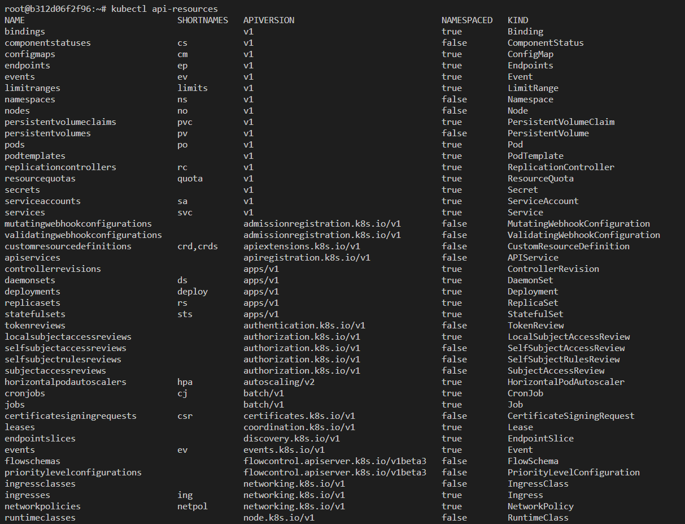

## kube-apiserver 실행하기



### 준비물

```bash
mkdir bin

# Bash
docker run -v $(pwd)/cert_k8s:/etc/kubernetes -v $(pwd)/bin:/root/bin -it --rm --add-host="test.kubernetes.local:127.0.0.1" week-1 bash
# PowerShell
docker run -v ${PWD}/cert_k8s:/etc/kubernetes -v ${PWD}/bin:/root/bin -it --rm --add-host="test.kubernetes.local:127.0.0.1" week-1 bash
```

### kube-apiserver설치

```bash
curl -L "https://dl.k8s.io/release/$(curl -L -s https://dl.k8s.io/release/stable.txt)/bin/linux/amd64/kube-apiserver" > /root/bin/kube-apiserver
chmod +x /root/bin/kube-apiserver
```

### kube-apiserver 실행

```bash
kube-apiserver \
    --client-ca-file=/etc/kubernetes/pki/ca.crt \
    --tls-cert-file=/etc/kubernetes/pki/apiserver.crt \
    --tls-private-key-file=/etc/kubernetes/pki/apiserver.key \
    --etcd-cafile=/etc/kubernetes/pki/etcd/ca.crt \
    --etcd-certfile=/etc/kubernetes/pki/apiserver-etcd-client.crt \
    --etcd-keyfile=/etc/kubernetes/pki/apiserver-etcd-client.key \
    --etcd-servers=https://127.0.0.1:2379 \
    --kubelet-preferred-address-types=InternalIP,ExternalIP,Hostname \
    --kubelet-client-certificate=/etc/kubernetes/pki/apiserver-kubelet-client.crt \
    --kubelet-client-key=/etc/kubernetes/pki/apiserver-kubelet-client.key \
    --kubelet-preferred-address-types=InternalIP,ExternalIP,Hostname \
    --proxy-client-cert-file=/etc/kubernetes/pki/front-proxy-client.crt \
    --proxy-client-key-file=/etc/kubernetes/pki/front-proxy-client.key \
    --requestheader-allowed-names=front-proxy-client \
    --requestheader-client-ca-file=/etc/kubernetes/pki/front-proxy-ca.crt \
    --requestheader-extra-headers-prefix=X-Remote-Extra- \
    --requestheader-group-headers=X-Remote-Group \
    --requestheader-username-headers=X-Remote-User \
    --allow-privileged=true \
    --authorization-mode=Node,RBAC \
    --enable-admission-plugins=NodeRestriction \
    --enable-bootstrap-token-auth=true \
    --secure-port=6443 \
    --service-account-issuer=https://kubernetes.default.svc.cluster.local \
    --service-account-key-file=/etc/kubernetes/pki/sa.pub \
    --service-account-signing-key-file=/etc/kubernetes/pki/sa.key \
    --service-cluster-ip-range=10.96.0.0/12 &
```

### 해설

```bash
kube-apiserver \
	# kube-apiserver <-> kubelet, kube-controller-manager, kubectl 등등 간 통신에 사용할 인증서
    --client-ca-file=/etc/kubernetes/pki/ca.crt \
    --tls-cert-file=/etc/kubernetes/pki/apiserver.crt \
    --tls-private-key-file=/etc/kubernetes/pki/apiserver.key \

    # etcd 통신에 사용할 인증서
    --etcd-cafile=/etc/kubernetes/pki/etcd/ca.crt \
    --etcd-certfile=/etc/kubernetes/pki/apiserver-etcd-client.crt \
    --etcd-keyfile=/etc/kubernetes/pki/apiserver-etcd-client.key \
    --etcd-servers=https://127.0.0.1:2379 \

    # kube-apiserver "에서" kubelet "으로" 통신할때 사용할 인증서
    # logging, metrics, "kubectl exec" 등등에 사용
    --kubelet-preferred-address-types=InternalIP,ExternalIP,Hostname \
    --kubelet-client-certificate=/etc/kubernetes/pki/apiserver-kubelet-client.crt \
    --kubelet-client-key=/etc/kubernetes/pki/apiserver-kubelet-client.key \
    --kubelet-preferred-address-types=InternalIP,ExternalIP,Hostname \

    # Kubernetes Aggregation API Layer 에서 사용할 클라이언트 인증서 (e.g., kube-apiserver -> metrics-server)
    # https://kubernetes.io/docs/tasks/extend-kubernetes/configure-aggregation-layer/
    --proxy-client-cert-file=/etc/kubernetes/pki/front-proxy-client.crt \
    --proxy-client-key-file=/etc/kubernetes/pki/front-proxy-client.key \

    # Proxy Auth 인증 방법을 사용할때 사용할 ca.crt
    --requestheader-client-ca-file=/etc/kubernetes/pki/front-proxy-ca.crt \
    --requestheader-allowed-names=front-proxy-client \
    --requestheader-extra-headers-prefix=X-Remote-Extra- \
    --requestheader-group-headers=X-Remote-Group \
    --requestheader-username-headers=X-Remote-User \

    # etc
    --allow-privileged=true \
    --authorization-mode=Node,RBAC \
    --enable-admission-plugins=NodeRestriction \
    --enable-bootstrap-token-auth=true \
    --secure-port=6443 \
    --service-account-issuer=https://kubernetes.default.svc.cluster.local \
    --service-account-key-file=/etc/kubernetes/pki/sa.pub \
    --service-account-signing-key-file=/etc/kubernetes/pki/sa.key \
    --service-cluster-ip-range=10.96.0.0/12 &
```

### 접속

```bash
kubeadm init phase kubeconfig admin --control-plane-endpoint test.kubernetes.local

kubectl version -o yaml
```

```yaml
clientVersion:
  buildDate: "2023-01-18T15:58:16Z"
  compiler: gc
  gitCommit: 8f94681cd294aa8cfd3407b8191f6c70214973a4
  gitTreeState: clean
  gitVersion: v1.26.1
  goVersion: go1.19.5
  major: "1"
  minor: "26"
  platform: linux/amd64
kustomizeVersion: v4.5.7
serverVersion:
  buildDate: "2023-01-18T15:51:25Z"
  compiler: gc
  gitCommit: 8f94681cd294aa8cfd3407b8191f6c70214973a4
  gitTreeState: clean
  gitVersion: v1.26.1
  goVersion: go1.19.5
  major: "1"
  minor: "26"
  platform: linux/amd64
```
